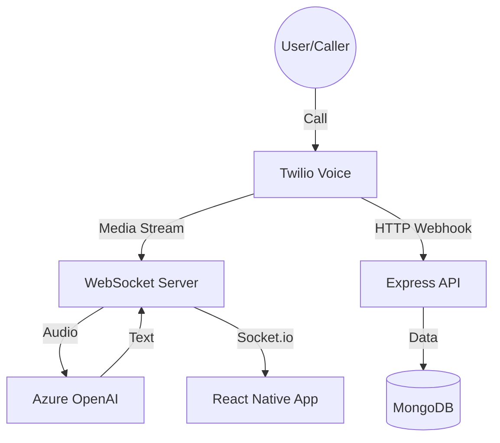

# Technical Requirement Document (TRD): Ringia 🏗️⚙️

## 1. Tech Stack
- **Mobile**: React Native (TypeScript), React Navigation, Zustand (State Management).
- **Backend**: Node.js, Express.
- **Database**: MongoDB Atlas (Mongoose ODM).
- **Real-time**: Socket.io (Client-Server), WebSockets (Twilio Media Streams).
- **AI/ML**: Azure OpenAI (GPT-4o), Twilio Voice API, Firebase Cloud Messaging (FCM).
- **Logic Engine**: Custom Rule-based Router for DND and Contact Filtering.
- **Tunneling**: ngrok (Local development exposing ports 4000/8081).

## 2. System Architecture

### 2.1 Call Flow Architecture
1. **Inbound Call**: Twilio receives a call and triggers a TwiML webhook.
2. **Media Stream**: Twilio opens a WebSocket connection to the Ringia backend to stream raw audio.
3. **AI Processing**: Backend sends audio/text to Azure OpenAI GPT-4o Realtime API.
4. **Live Update**: Backend pushes transcripts to the Mobile App via Socket.io.
5. **Takeover**: Backend issues a TwiML redirect to Twilio to bridge the call to the mobile client or a secondary number.

### 2.2 Component Diagram

## 3. Database Schema

### 3.1 User Model
- `email`: String (Unique, Indexed)
- `password`: Hashed String (bcrypt)
- `twilioNumber`: String
- `userPin`: String (4-6 digits)
- `aiSettings`: Object { voice, tone, greeting, closingStatement }
- `deliveryPreferences`: Object { 
    address: String, 
    gateCode: String, 
    dropOffInstructions: String,
    deliveryApps: Array[String] 
  }
- `availability`: Object { 
    dndEnabled: Boolean, 
    dndSchedule: { start: Time, end: Time } 
  }
- `callerRules`: Array [ { phoneNumber: String, action: Enum['always_ai', 'always_bridge', 'block'] } ]

### 3.2 Call Model
- `userId`: ObjectId (Ref: User)
- `callSid`: String (Twilio Unique ID)
- `callerNumber`: String
- `callerName`: String
- `status`: String (ringing, active, ended, recorded)
- `transcript`: Array [ { role, text, timestamp } ]
- `analysis`: Object { intent, summary, sentiment, actionItems }
- `durationSeconds`: Number

## 4. API Endpoints

### 4.1 Authentication
- `POST /api/auth/register`: Signup.
- `POST /api/auth/login`: Login (returns JWT).
- `GET /api/auth/me`: Current profile.

### 4.2 Calls
- `GET /api/calls`: Paginated history.
- `GET /api/calls/:id`: Full details.
- `POST /api/calls/:id/takeover`: Initiate human takeover.
- `GET /api/calls/stats`: Dashboard analytics.

### 4.3 Voice (Twilio)
- `POST /voice/incoming-call`: TwiML generation.
- `POST /voice/call-status`: Handling hang-ups.
- `WebSocket /voice/media-stream`: Raw audio pipe.

## 5. Security Requirements
- **JWT Authentication**: All `/api` routes protected via Bearer tokens.
- **Twilio Validation**: Incoming webhooks must have `X-Twilio-Signature` verification in production.
- **CORS**: Restricted to specific origins (ngrok, localhost) in production.

## 6. Development & Deployment
- **Offline/Demo Mode**: Backend fallbacks to mock data if MongoDB is unreachable.
- **Environment Variables**: `.env` for all secrets (API Keys, DB URIs).
- **Tunneling**: ngrok usage for local mobile testing against physical Twilio numbers.
